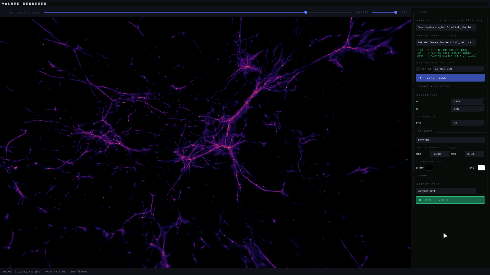

# RenderPath

<br>

<p align="center">
    
</p>

<br>

GPU-accelerated volume renderer for large particle/AMR datasets. Renders fly-through videos along a camera path using OpenGL instanced drawing and a two-pass depth-accumulation / tone-mapping pipeline.

Two renderers, one workflow:

- **`python -m qt_renderer`** — interactive GUI for previewing data and tweaking render parameters on your local machine.
- **`python -m egl_renderer`** — headless EGL renderer for standard and VR (180 and 360) production renders on a remote server (no display required).

---

## How it works

Each point in the dataset is represented as a scaled cube instance. The render pipeline has two passes per frame:

**Pass 1 — Depth accumulation**
All cube instances are drawn into an offscreen `RG32F` framebuffer with additive blending. Each fragment writes `(quantity × weight × distance, weight × distance)` into the R and G channels, accumulating a weighted sum over all overlapping instances along each ray.

**Pass 2 — Tone mapping**
A full-screen quad reads the accumulation buffer and computes `log10(R / G)` per pixel — the depth-weighted mean of the quantity field. The result is mapped through a matplotlib colormap texture with configurable min/max clamp values, under/over colors, and output to the final framebuffer.

Frames are piped to ffmpeg in real time via stdin using double-buffered PBOs to avoid GPU pipeline stalls.

---

## Data format

All renderers expect the same binary file: **six contiguous `float32` arrays**, each of length `N`, stored back-to-back with no header:

```
[ x₀ x₁ … x_{N-1} | y₀ … | z₀ … | dx₀ … | qty₀ … | w₀ … ]
```

| Field | Meaning |
|-------|---------|
| `x, y, z` | World-space position of the cell centre |
| `dx` | Cell size (uniform cube half-width) |
| `qty` | Scalar quantity to visualise |
| `w` | Statistical weight |

### Camera path format

The camera path format differs per renderer:

**`egl_renderer` and `qt_renderer`** — nine space-separated floats per row:
```
px py pz   cx cy cz   nx ny nz
```
`(px, py, pz)` is the camera position, `(cx, cy, cz)` is the look-at target, and `(nx, ny, nz)` is the up vector.

**`egl_renderer_vr` — VR180 mode** — six floats per row:

```
px py pz   fx fy fz
```
`(fx, fy, fz)` is the forward/zenith direction — the centre of the fisheye circle.

**`egl_renderer_vr` — VR360 mode** — three floats per row (position only; all directions are captured):
```
px py pz
```

---

## Requirements

- Python 3.9+
- PyQt5
- PyOpenGL
- NumPy
- Matplotlib
- tqdm
- psutil *(optional, recommended)*
- ffmpeg on PATH
- OpenGL 3.3 Core Profile GPU
- EGL (headless renderer only)

## Installation

**Clone github repo:**

```bash
git clone git@github.com:stuvw/RenderPath.git
```

**Change directory into repo:**

```bash
cd RenderPath
```

**Create a Python virtual environment:**

|   Platform  |              Command           |
| ----------- | ------------------------------ |
| Linux/Macos | `$ python3 -m venv ./.venv`    |
| Windows     | `C:\> python3 -m venv .\.venv` |

**Activate the Python virtual environment:**

|    Platform    |   Shell    |             Command                    |
| -------------- | ---------- | -------------------------------------- |
|  Linux/Macos   | bash/zsh   | `$ source ./.venv/bin/activate`        |
|                | fish       | `$ source ./.venv/bin/activate.fish`   |
|                | csh/tcsh   | `$ source ./.venv/bin/activate.csh`    |
|                | pwsh       | `$ ./.venv/bin/Activate.ps1`           |
|    Windows     | cmd.exe    | `C:\> .\.venv\Scripts\activate.bat`    |
|                | PowerShell | `PS C:\> .\.venv\Scripts\Activate.ps1` |

**Install dependancies:**

```bash
# Install headless rendering dependancies
pip install -r requirements-egl.txt

# Install GUI rendering dependancies
pip install -r requirements-qt.txt

# Install all dependancies
pip install -r requirements-all.txt

# Install all dependancies manually
pip install PyQt5 PyOpenGL numpy matplotlib tqdm psutil
```

`psutil` is optional but strongly recommended — without it the GUI cannot warn you about memory limits before loading.

ffmpeg must be available on `PATH` for video export:

```bash
# Debian / Ubuntu
sudo apt install ffmpeg

# Arch
sudo pacman -S ffmpeg

# Fedora
sudo dnf install -y ffmpeg

# RHEL
sudo yum install -y ffmpeg

# macOS
brew install ffmpeg

# Windows
winget install ffmpeg
```

---

## GUI usage (`qt_renderer`)

```bash
python -m qt_renderer
```

### Files panel

Load a data file and a camera path file. Before you click **LOAD FILES**, the panel shows an instant memory estimate based on the file size alone (no data is read yet):

```
File   : 14.3 GB  (643,145,000 pts)
RAM    : ~22.9 GB peak  (71% of total)
VRAM   : ~14.7 GB steady  (92% of total)
```

Labels turn red with a ⚠ warning if loading would likely exhaust RAM or VRAM. When you click **LOAD FILES**, free VRAM is queried from the GPU driver (NVIDIA and AMD extensions are supported) and an auto-cap dialog appears if either resource would be exceeded — offering to reduce the point count to a safe level.

**MAX POINTS TO LOAD** lets you set a hard cap manually. Points are selected by random sampling (fixed seed 0) so that the loaded subset is spatially representative. Only the selected points are read from disk and uploaded to VRAM; the rest of the file is never touched.

### Preview scrubber

The scrub bar at the top of the viewport contains two controls:

- **Frame slider** — scrub through the camera path. The GL preview updates immediately.
- **POINTS slider** (1 % – 100 %) — reduce the number of instances drawn in the preview. At 10 % you draw one tenth of the loaded points, making scrubbing much faster on large datasets. This slider has no effect on video export, which always uses the full loaded point count.

### Colormap panel

| Control | Effect |
|---------|--------|
| Colormap dropdown | Any matplotlib colormap |
| min / max | log₁₀ range mapped to the colormap ends |
| under color | Color for pixels below min |
| over color | Color for pixels above max |

Changes apply to the preview immediately.

### Export Resolution panel

Sets the pixel dimensions and framerate used for video export only. Independent of the preview viewport size.

### Export panel

Choose an output `.mp4/.mkv` path and click **RENDER VIDEO**. Export uses `libx264` by default. Progress is shown in the status bar. Click **CANCEL** to abort mid-render.

**NOTE:** If you know a thing or two about ffmpeg, I recommend switching the encoder to a GPU hardware accelerated one, if your system supports it, as it will greatly offload work off the CPU.

---

## Headless usage (`egl_renderer`)

Intended for final standard renders on GPU servers where no display is available. Requires a working EGL installation.

```bash
python -m egl_renderer \
    --mode normal \
    --data-file   simulation.bin \
    --camera-file path.txt \
    --video-file  out.mp4 \
    --width  3840 \
    --height 2160 \
    --framerate 60 \
    --minval -3.0 \
    --maxval  3.0 \
    --colormap inferno \
    --undercolor 0 0 0 1 \
    --overcolor  1 1 1 1 \
    --badcolor   1 0 1 1 \
    --hwaccel none \
    --encoder libx264
```

### Full argument reference

| Argument | Short | Default | Description |
|----------|-------|---------|-------------|
| `--mode` || `normal`| Rendering mode (normal, vr180 or vr360) |
| `--data-file` | `-df` | required | Binary volume data file |
| `--camera-file` | `-cf` | required | Camera path text file (9-col for normal mode, 6-col for vr180 and 3-col for vr360) |
| `--video-file` | `-vf` | `out.mp4` | Output video path |
| `--width` | `-wx` | `1280` | Output width in pixels |
| `--height` | `-hy` | `720` | Output height in pixels (automatically calculated for vr: ÷2 for vr360, =width for vr180)|
| `--framerate` | `-fr` | `30` | Output framerate |
| `--minval` | | `-3.0` | Lower end of log₁₀ colormap range |
| `--maxval` | | `3.0` | Upper end of log₁₀ colormap range |
| `--colormap` | `-cm` | `inferno` | Matplotlib colormap name |
| `--undercolor` | | `0 0 0 1` | RGBA color for values below min |
| `--overcolor` | | `1 1 1 1` | RGBA color for values above max |
| `--badcolor` | | `1 0 1 1` | RGBA color for NaN/error values |
| `--encoder` | | `x264` | Video encoder used |
| `--hwaccel` | | `none` | Use available hardware acceleration to render the video |

### VR usage

Produces immersive video in two formats, selected via `--mode`:

- **`vr360`** — equirectangular (2:1), suitable for Meta Quest and other 360° headsets. Spherical metadata is embedded automatically.
- **`vr180`** — domemaster azimuthal-equidistant fisheye (1:1 square, 180° FOV), suitable for fulldome theatres and half-sphere VR playback.

**Output formats**

| Mode | Aspect | Resolution example | Headset |
|------|--------|--------------------|---------|
| `vr360` | 2:1 | 7680 × 3840 (8K) | Meta Quest, YouTube VR, any 360° player |
| `vr180` | 1:1 | 4096 × 4096 (4K) | Fulldome theatres, half-sphere VR |

### Video Encoding & Hardware Acceleration

This application uses FFmpeg to stitch OpenGL frames into a video file. Because performance varies significantly across different operating systems and hardware configurations, you can customize the encoding pipeline using two main flags.

For a deep dive into available options, refer to the [FFmpeg Codec Documentation](https://ffmpeg.org/ffmpeg-codecs.html).

1. **Choosing a Video Encoder (`--encoder`)**

The encoder determines the compression efficiency and visual quality. Use the --encoder flag to select one of the following:

| Encoder name | Argument | Best Use Case | Notes |
|--------------|----------|---------------|-------|
| **AVC / [libx264](https://trac.ffmpeg.org/wiki/Encode/H.264)** | `x264` | Standard (Up to 1080p) | The default choice. Highly compatible and reliable, but slower at high resolutions.|
| **HEVC / [libx265](https://trac.ffmpeg.org/wiki/Encode/H.265)** | `x265` | High Res (4K+) | Great for high-fidelity renders; provides better compression than x264. |
| **AV1 / [libsvtav1](https://trac.ffmpeg.org/wiki/Encode/AV1#SVT-AV1)** | `av1` | Ultra-High Res | The most modern codec. Superior efficiency, though it requires more CPU power. |

2. **Hardware Acceleration (`--hwaccel`)**

By default, encoding is performed by your CPU (Software Encoding). To speed up the process and reduce CPU load, you can offload the work to your GPU using the `--hwaccel` flag.

**Note**: Hardware encoders are extremely fast but may offer slightly lower "quality-per-bitrate" than software encoders.

Available hardware interfaces depend on your GPU vendor:

| Vendor | Encoder | Argument |
|--------|---------|----------|
| **NVIDIA** | [NVENC](https://docs.nvidia.com/video-technologies/video-codec-sdk/13.0/ffmpeg-with-nvidia-gpu/index.html) | `nvenc` |
| **AMD** | [AMF](https://trac.ffmpeg.org/wiki/Hardware/AMF) | `amf` |
| **Intel** | [QSV](https://trac.ffmpeg.org/wiki/Hardware/QuickSync) | `qsv` |

If you are unsure what your specific build of FFmpeg supports, run the following command in your terminal:

```bash
ffmpeg -encoders
```

You can also check what encoders are supported based on your platform [here](https://trac.ffmpeg.org/wiki/HWAccelIntro).

Video encoding is very tricky to set up, and is an endless rabbit hole (especially hardware encoding), so I cannot guarantee that it will work for you.

---

## Recommended workflow

1. Run `python -m qt_renderer` locally. Use the POINTS slider at ~10 % and scrub through the camera path to check framing, colormap range, and pacing.
2. Adjust min/max, colormap, under/over colors until the preview looks right.
3. Note the parameter values. If VRAM is tight locally, use the MAX POINTS cap to stay within limits — the preview is still representative.
4. SSH to your render server. Run `egl_renderer` with the same parameter values at full resolution against the full unsampled dataset.

---

## Memory usage

| Resource | Formula | Notes |
|----------|---------|-------|
| RAM peak (no cap) | `N × 40 bytes` | 6 column copies + column_stack temp |
| RAM peak (with cap) | `N_file × 8 + N_load × 40` | Index array added when subsampling |
| VRAM steady | `N × 24 bytes` | (x,y,z,dx) + qty + w, three GPU buffers |

These are exact figures, not estimates. A dataset with 500 M points at full load requires ~20 GB RAM peak and ~12 GB VRAM steady.

---